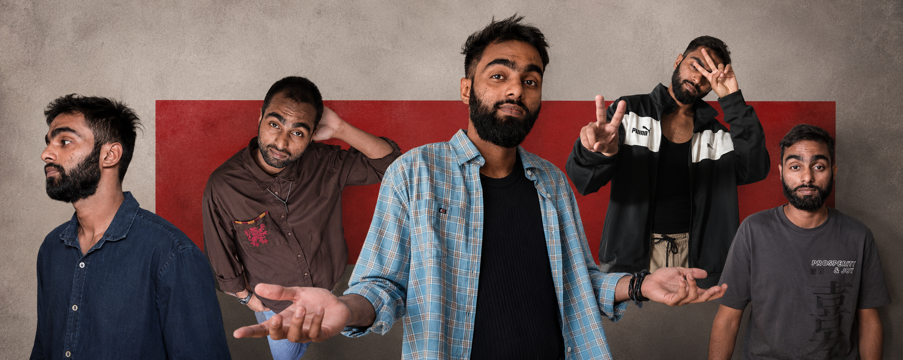

<div align="center">



# Vaibhav · Portfolio


<p align="center">
  
  
  
  
  
  
</p>

**A high-performance, production-grade portfolio engineered for technical depth and visual impact.**  
Built with React 18, Framer Motion physics, and a hardware-accelerated canvas engine.

[**→ Live Site**](https://www.howvaibhav.in)

 &nbsp;  &nbsp; 

</div>

---

## Overview

This portfolio is a monorepo containing a React frontend and a Node.js/Express backend. It is engineered around three core pillars:

1. **Performance First** — Hardware-accelerated canvas for frame scrubbing, GPU-composited animations, DPR-aware rendering, and aggressive CDN caching.
2. **Neo-Brutalist Aesthetics** — A high-contrast dark design system with lime (`#CCFF00`) and blue (`#2555FF`) accents, heavy typography, and deliberate visual tension.
3. **Developer Experience** — A clean monorepo structure with clearly-named assets, reusable UI primitives, and a consistent responsive system via a shared `useResponsive` hook.

---

## Modes

### 🖥 Developer Mode — `v1` · *Live*
The primary portfolio experience at `/`. A dark, cyber-industrial showcase of full-stack engineering work, system architecture, and technical projects.

**Highlights:**
- Pixel image reveal animation on the hero section (grayscale → color)
- Scroll-driven parallax on the Tools & Stack banner
- Spring-physics-based Framer Motion card animations throughout
- Dual-direction infinite tech marquee with 30+ tools
- Timeline-based career experience section

### 🎨 Design Studio Mode — `v2` · *Under Development*
Accessible at `/design`. The second version of the portfolio — a curated editorial experience for design clients and creative collaborators.

> **Design Mode is Portfolio v2**, currently under active development. It will feature an editorial visual identity, brand case studies, typography systems, and interactive creative media.

---

## Featured Projects

### eMineral Pass
- **Domain:** Government-Compliant Mineral Logistics SaaS  
- **Stack:** Next.js, TypeScript, Supabase, PostgreSQL, Tailwind CSS  
- **Architecture:** End-to-end authorization engine compliant with UP Minerals Rules 2018. Real-time cryptographically signed QR verification, bilingual PDF permit generation (English + Devanagari Hindi), automated royalty calculation, and role-based audit logs.  
- **Live:** https://www.mineraltrack.shop/

### GovAid Sikkim
- **Domain:** Citizen Welfare Scheme Discovery & Evaluation Engine  
- **Stack:** Django 5, Python 3.12, PostgreSQL, Tailwind CSS  
- **Architecture:** Centralized welfare scheme evaluation engine. Verhoeff algorithm Aadhaar checksum verification, field-level Fernet symmetric encryption for sensitive demographic data, rule-based qualification pipelines.  
- **Live:** https://govaid-5n3k.onrender.com/

### LOG Detector
- **Domain:** Cyber Forensics & Threat Timeline Analyzer  
- **Stack:** Python 3.8+, Shannon Entropy Engine, Rich CLI, Flask, React  
- **Architecture:** High-throughput parallel log forensic tool processing large server logs in seconds. Computes Shannon entropy baselines to identify obfuscated payloads and correlates anomalous events against 5-stage cyber kill-chains.

---

## Repository Structure

```text
Portfolio/
├── frontend/                        # Client-Side App (Vite + React 18)
│   ├── public/
│   │   ├── assets/
│   │   │   ├── vaibhav-hero-cutout.png         # Hero section subject cutout (PNG)
│   │   │   ├── footer-banner.png               # Tools section background banner
│   │   │   ├── photo-intro-portrait.jpg        # About/intro portrait
│   │   │   ├── photo-coding-lifestyle.jpg      # Lifestyle coding photo
│   │   │   ├── photo-study-desk.jpg            # Study desk environment photo
│   │   │   ├── project-govaid-screenshot.png   # GovAid project screenshot
│   │   │   ├── project-logdetector-screenshot.png  # LOG Detector screenshot
│   │   │   └── project-emineral-screenshot.png # eMineral Pass screenshot
│   │   ├── frames/                             # Canvas scroll animation frames (001–199)
│   │   └── favicon.svg                         # Custom V monogram brand favicon
│   ├── src/
│   │   ├── components/
│   │   │   ├── Dev/                            # Developer mode section components
│   │   │   │   ├── DevNavbar.jsx               # Fixed top nav with animated active pill
│   │   │   │   ├── DevHero.jsx                 # Hero: pixel reveal, spring parallax
│   │   │   │   ├── DevFeaturedWork.jsx         # Scroll-animated project cards
│   │   │   │   ├── DevToolsStack.jsx           # Marquee + parallax banner
│   │   │   │   ├── DevExperience.jsx           # Career timeline
│   │   │   │   ├── DevTestimonials.jsx         # Social proof section
│   │   │   │   ├── DevContactCta.jsx           # Footer & call-to-action
│   │   │   │   ├── useResponsive.js            # Centralized breakpoint hook
│   │   │   │   ├── useReveal.js                # Intersection Observer reveal hook
│   │   │   │   └── dev.css                     # Dev mode design tokens & animations
│   │   │   ├── Navbar/
│   │   │   │   └── Navbar.jsx                  # Shared design-mode navigation
│   │   │   ├── ui/                             # Reusable Motion UI primitives
│   │   │   │   ├── marquee.jsx                 # Infinite scroll marquee
│   │   │   │   ├── morphing-text.jsx           # SVG blur/threshold word morph
│   │   │   │   ├── pixel-image.jsx             # Pixel grid reveal animation
│   │   │   │   ├── ripple.jsx                  # Concentric CSS ripple pulse
│   │   │   │   └── scroll-based-velocity.jsx   # Velocity-aware scroll marquee
│   │   │   ├── AboutSection.jsx
│   │   │   ├── CanvasScrollAnimation.jsx       # 60fps frame-scrubbing canvas engine
│   │   │   ├── ContactScaleSection.jsx
│   │   │   ├── CreativeProjectsSection.jsx
│   │   │   ├── EducationSection.jsx
│   │   │   ├── IntroductionSection.jsx
│   │   │   ├── ModeToggle.jsx                  # Radial clip-path mode switcher
│   │   │   ├── VaibhavStudioSection.jsx
│   │   │   └── WelcomeSection.jsx
│   │   ├── lib/
│   │   │   └── utils.js                        # Utility helpers (cn, clsx)
│   │   ├── pages/
│   │   │   ├── DevPage.jsx                     # Developer portfolio page (v1)
│   │   │   └── DesignPage.jsx                  # Design studio page (v2 — WIP)
│   │   ├── App.jsx                             # Client-side routing
│   │   ├── index.css                           # Global design tokens
│   │   └── main.jsx
│   ├── index.html                              # Asset preloads, fonts, meta
│   ├── package.json
│   └── vite.config.js
├── backend/                         # Node.js / Express API Service
│   ├── src/
│   │   ├── routes/
│   │   │   └── index.js             # REST endpoints & health checks
│   │   └── server.js                # Express setup & middleware
│   ├── .env.example
│   └── package.json
├── .gitattributes                   # LF line-ending normalization
├── .gitignore
├── package.json                     # Root workspace runner
├── vercel.json                      # Root SPA routing & deployment config
└── README.md
```

---

## Getting Started

### Prerequisites
- **Node.js:** v18.0.0+
- **npm:** v9.0.0+

### 1. Clone
```bash
git clone https://github.com/how-vaibhav/Portfolio.git
cd Portfolio
```

### 2. Install
```bash
npm install
```

### 3. Develop
Start frontend and backend concurrently:
```bash
npm run dev
```
| Service | URL |
|---|---|
| Frontend | http://localhost:5173 |
| Design Mode | http://localhost:5173/design |
| Backend API | http://localhost:5001 |

Run independently:
```bash
npm run dev:frontend   # Frontend only
npm run dev:backend    # Backend only
```

---

## Deployment

### Vercel (Recommended)
1. Import this repository into [Vercel](https://vercel.com).
2. The bundled `vercel.json` handles:
   - **SPA Routing:** Rewrites `/`, `/design`, and all subroutes to `/index.html`.
   - **Immutable Caching:** `Cache-Control: public, max-age=31536000, immutable` on all static frames and images via Vercel Edge CDN.
3. Every push to `main` triggers an automatic production deployment.

### Local Production Build
```bash
npm run build
```
Outputs to `frontend/dist` with full minification, CSS purging, and asset fingerprinting.

---

## Tech Stack

| Layer | Technology |
|---|---|
| Framework | React 18, React DOM |
| Build Tool | Vite 6 |
| Routing | React Router v7 |
| Styling | Vanilla CSS, Tailwind CSS v4 |
| Animation | Framer Motion (`motion/react`), SVG Threshold Filters |
| Canvas Engine | HTML5 Canvas 2D (`createImageBitmap`, `requestAnimationFrame`) |
| Typography | Archivo Black, Inter, Bebas Neue, Fira Code, Syne, Lobster Two, Caveat |
| Backend | Node.js, Express.js, CORS |
| Deployment | Vercel Edge Network |

---

## License

Open source under the [MIT License](LICENSE).
